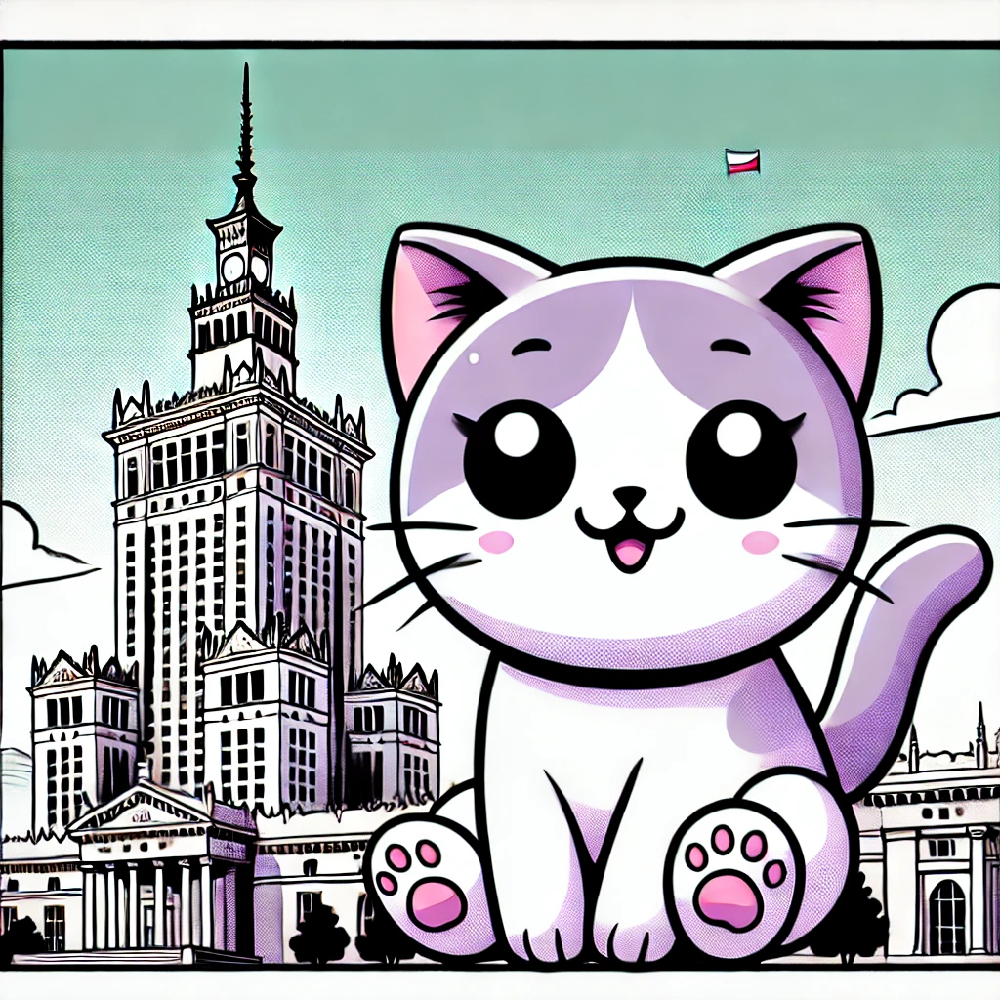

# Lady Nyan 🐾

### 🖥️ Code by Day, 🌙 Adventures by Night

Hi there! I'm Lady Nyan, a curious girl with a love for cats and a passion for coding — especially when it comes to IoT, networking, and embedded systems.
Currently, I’m on a mission to build my own MQTT broker from scratch — one line of code at a time. 🐱💻

*Lady Nyan enjoying the view at the Palace of Culture and Science in Warsaw, Poland.*

### 🎓 A Bit About Me

- **Education:** Studied Computer Science with a focus on Embedded Systems, Networking, and IoT.
- **Work Experience:** I spent some time in the tech hubs of Wrocław and Warsaw, Poland, diving into IoT projects and mastering MQTT protocols. Now, I’m coding from my cozy corner in Nuremberg, Germany.

### ⚡ Current Projects

- **MQTT Broker Series:** [Building an MQTT Broker from Scratch](#) (in work, not yet published)
  *Follow along as I create a full MQTT broker in code, starting with a basic TCP Echo Server!*

- **IoT Adventures:** From sensors to smart devices, I’m always experimenting with new projects and sharing the results.

### 🧰 Tech Stack

- **Languages:** C, C++, Rust and Python
- **Tools:** MQTT, Docker, Linux
- **Interests:** IoT, Networking, Protocol Design

### 🌐 Where I've Coded

- 🐾 **Wrocław, Poland:** Tackling embedded systems and smart devices.
- 🐾 **Warsaw, Poland:** Innovating with IoT solutions.
- 🐾 **Nuremberg, Germany:** Exploring MQTT and message protocols.

### 💬 Want to Chat?

I’m always up for talking about code, tech, and, of course, catnip. Feel free to reach out or contribute to any of my projects!

---

Thanks for stopping by! Don’t forget to star ⭐ my repositories if you find them helpful or interesting!
